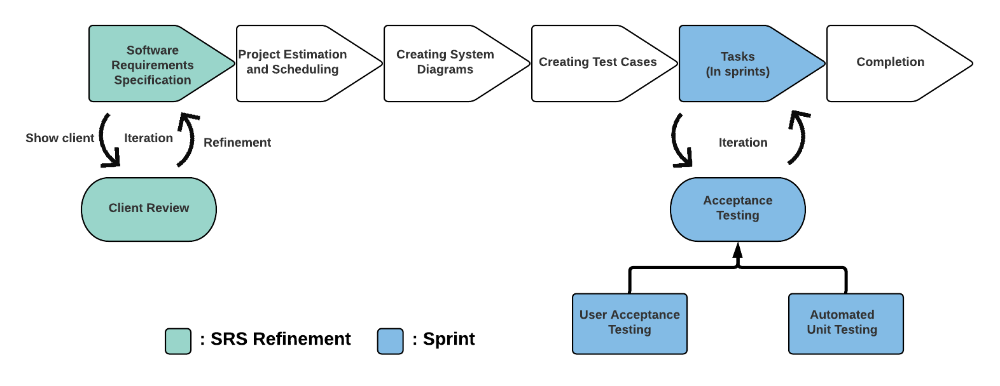
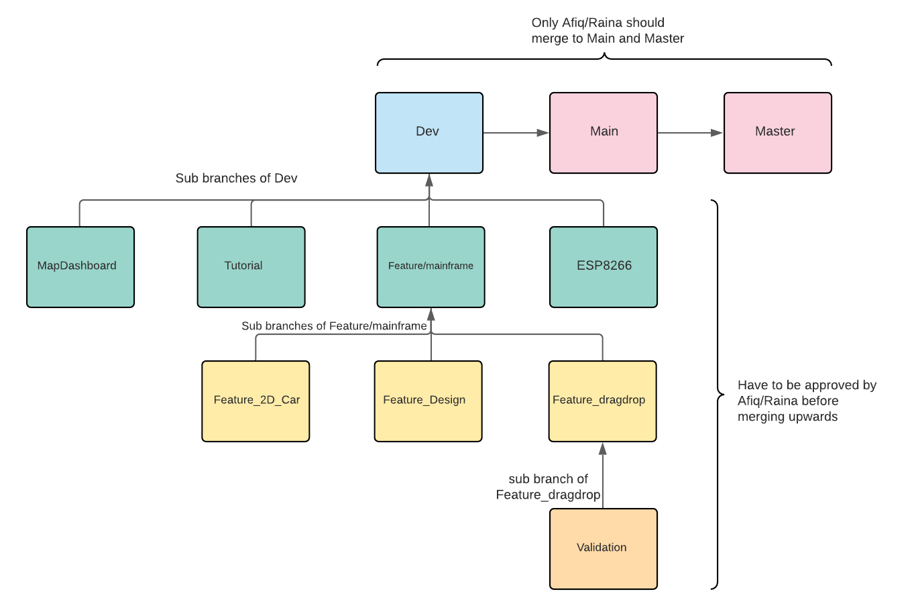
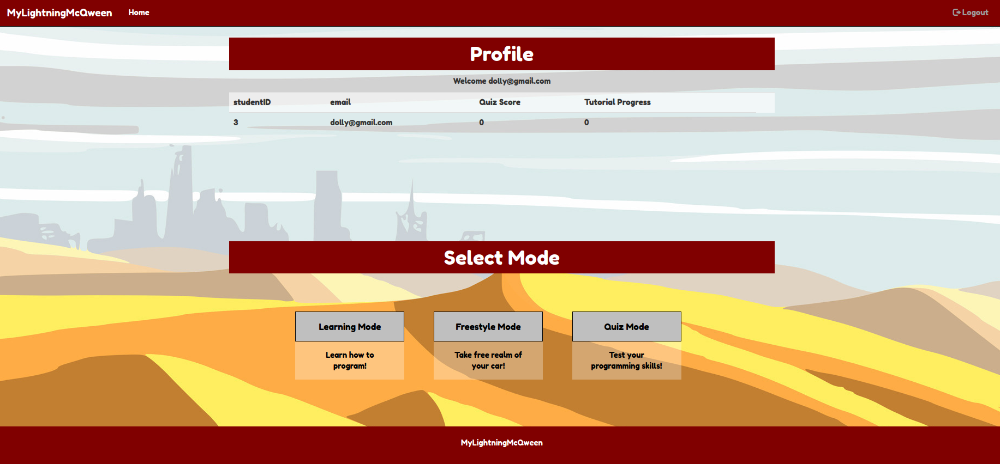
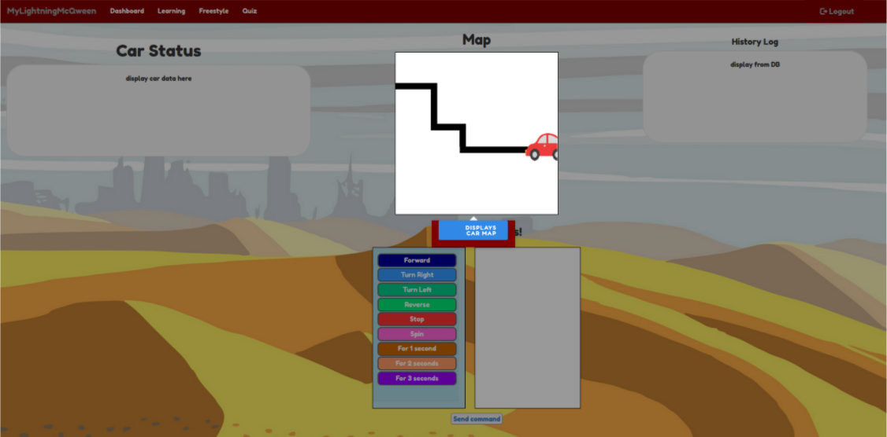
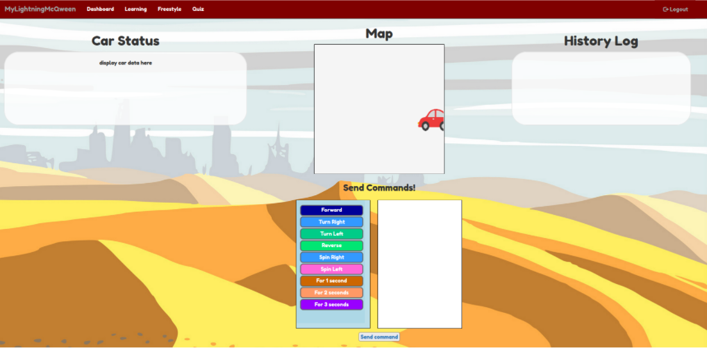
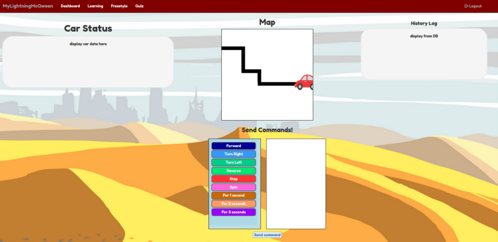
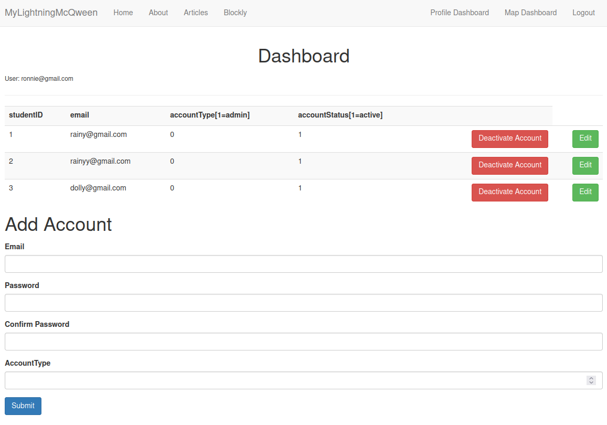
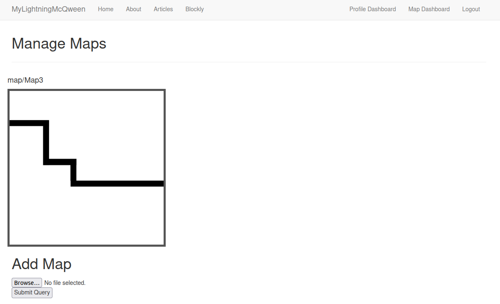
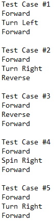

# ICT2101-Lightning-MCQWEEN

## Description:
Lightning MCQween is an interactive web portal for primary school students to learn programming logic while controlling their robotic cars.


## Prototype Implementation
### Development Workflow



### How to run
1. Ensure that MySQL is installed and create the following MySQL database:
```
-- MySQL Script generated by MySQL Workbench
-- Sat Nov 13 12:19:47 2021
-- Model: New Model    Version: 1.0
-- MySQL Workbench Forward Engineering

SET @OLD_UNIQUE_CHECKS=@@UNIQUE_CHECKS, UNIQUE_CHECKS=0;
SET @OLD_FOREIGN_KEY_CHECKS=@@FOREIGN_KEY_CHECKS, FOREIGN_KEY_CHECKS=0;
SET @OLD_SQL_MODE=@@SQL_MODE, SQL_MODE='ONLY_FULL_GROUP_BY,STRICT_TRANS_TABLES,NO_ZERO_IN_DATE,NO_ZERO_DATE,ERROR_FOR_DIVISION_BY_ZERO,NO_ENGINE_SUBSTITUTION';

-- -----------------------------------------------------
-- Schema mydb
-- -----------------------------------------------------

-- -----------------------------------------------------
-- Schema mydb
-- -----------------------------------------------------
CREATE SCHEMA IF NOT EXISTS mydb DEFAULT CHARACTER SET utf8 ;
USE mydb ;

-- -----------------------------------------------------
-- Table mydb.admin
-- -----------------------------------------------------
CREATE TABLE IF NOT EXISTS mydb.admin (
  adminID INT UNSIGNED NOT NULL AUTO_INCREMENT,
  email VARCHAR(50) NOT NULL,
  password CHAR(128) NOT NULL,
  accountType INT UNSIGNED NOT NULL,
  accountStatus INT UNSIGNED NOT NULL,
  UNIQUE INDEX adminID_UNIQUE (adminID ASC) VISIBLE,
  PRIMARY KEY (adminID),
  UNIQUE INDEX email_UNIQUE (email ASC) VISIBLE)
ENGINE = InnoDB;


-- -----------------------------------------------------
-- Table mydb.Student
-- -----------------------------------------------------
CREATE TABLE IF NOT EXISTS mydb.Student (
  studentID INT UNSIGNED NOT NULL AUTO_INCREMENT,
  email VARCHAR(50) NOT NULL,
  password CHAR(128) NOT NULL,
  accountType INT UNSIGNED NOT NULL,
  accountStatus INT UNSIGNED NOT NULL,
  quizScore INT UNSIGNED NOT NULL,
  quizProgress INT UNSIGNED NOT NULL,
  tutorialProgress INT UNSIGNED NOT NULL,
  PRIMARY KEY (studentID),
  UNIQUE INDEX studentID_UNIQUE (studentID ASC) VISIBLE,
  UNIQUE INDEX email_UNIQUE (email ASC) VISIBLE)
ENGINE = InnoDB;


SET SQL_MODE=@OLD_SQL_MODE;
SET FOREIGN_KEY_CHECKS=@OLD_FOREIGN_KEY_CHECKS;
SET UNIQUE_CHECKS=@OLD_UNIQUE_CHECKS;
CREATE TABLE maps (
  mapID int(11) NOT NULL,
  mapData mediumblob NOT NULL,
  mapName varchar(20) NOT NULL
) ENGINE=InnoDB DEFAULT CHARSET=utf8mb4;
```
2. Export and Run the Flask Application
```
export FLASK_APP=webPortal.py
flask run
```
3. Browse to 127.0.0.1:5000 and you'll see the login page.


### Student Login
#### Student Dashboard:
The student has to login using their accounts (Created by the Administrator). Once logged in, they will be able to see their student dashboard.
The following are the details displayed:
1. Student ID
2. email
3. Quiz score
4. Tutorial Progress

From the student dashboard, they should be able to select the available modes which will redirect them to the respective pages.
There are 3 Modes Available:
1. Learning mode
2. Freestyle mode
3. Quiz mode



#### Learning mode
The web portal redirects the student to learningPage.html when "Learning mode" is selected. The "Learning mode" will walk the student through each component
of the page with simple explanations.The student has to click on the explanations to go to the next component to ensure that they have read them.


#### Freestyle mode
The web portal redirects the student to freestylePage.html when "Freestyle mode" is selected. The map will be displayed as an empty canvas to give
students the freedom to control their car to go any direction using the available commands.


#### Quiz mode
The web portal redirects the student to quizPage.html when "Quiz mode" is selected. A map will be displayed for students to navigate the car through. The commands submitted
by the student will be validated before sending them out to the car itself.


### Administrator
#### Profile Dashboard
Only accessible by the Admin where he/she is able to create/edit/delete admin/student accounts. The Profile dashboard will display the following details:
1. studentID
2. email
3. Account Type (0: student, 1: admin)
4. Account Status ( 0: Deactivated, 1: Active)
5. Add Account form with the following data fields:
  - Email, Password, Confirm Password, Account Type


#### Map Dashboard
Only accessible by the Admin where he/she is able to upload new maps which are displayed in "Learning mode" and "Quiz Mode".


### User Acceptance Testing
[](https://youtu.be/enSM8fXKbDU)

| ID  | Test Case Description | Precondition | Steps | Expected Result | Actual Result | P/F |
| ------------- | ------------- | ------------- | ------------- | ------------- | ------------- | ------------- |
| ST1  | Opening the web application  | In Web Browser  | 1. Browse to web application URL 2. Observe screen  | Sees the Login Page  | Sees the Login Page  | P |
| ST2  | Logging into Admin dashboard with valid email and valid password | In Login Page  | 1. Key in valid Admin email<br />2. Key in valid Admin password<br />3. Click the "Login" button<br />4. Observe screen"  | Sees the Profile Dashboard  | Sees the Profile Dashboard  | P |
| ST3  | Logging into Admin dashboard with invalid email and valid password  | In Login Page  | 1. Key in invalid Admin email<br />2. Key in valid Admin password<br />3. Click the "Login" button<br />4. Observe screen"    | Sees the User Login page with the message "Invalid login"  | Sees the User Login page with the message "Invalid login"  | P |
| ST4  | Logging into Admin dashboard with valid email and invalid password  | In Login Page  | 1. Key in valid Admin email<br />2. Key in invalid Admin password<br />3. Click the "Login" button<br />4. Observe screen"    | Sees the User Login page with the message "Invalid login"  | Sees the User Login page with the message "Invalid login"  | P |
| ST5  | Logging into Admin dashboard with invalid email and invalid password  | In Login Page  | 1. Key in invalid Admin email<br />2. Key in invalid Admin password<br />3. Click the "Login" button<br />4. Observe screen"    | Sees the User Login page with the message "Invalid login"  | Sees the User Login page with the message "Invalid login"  | P |
| ST6  | Logging into Admin dashboard with no email and no password  | In Login Page  | 1. Key nothing for Admin email<br />2. Key nothing for Admin password<br />3. Click the "Login" button<br />4. Observe screen"    | Sees the User Login page with the message "Invalid login"  | Sees the User Login page with the message "Invalid login"  | P |
| ST7  | Logging into Student dasboard  | In Login Page  | 1. Key in valid email<br />2. Key in valid password<br />3. Click the "Login" button<br />4. Observe screen  | sees the Student Dashboard  | sees the Student Dashboard  | P |
| ST8  | Logging into Student dashboard with invalid email and valid password  | In Login Page  | 1. Key in invalid email<br />2. Key in valid password<br />3. Click the "Login" button<br />4. Observe screen  | Sees the User Login page with the message "Invalid login"  | Sees the User Login page with the message "Invalid login"  | P  |
| ST9  | Logging into Student dashboard with valid email and invalid password  | In Login Page  | 1. Key in valid email<br />2. Key in invalid password<br />3. Click the "Login" button<br />4. Observe screen  | Sees the User Login page with the message "Invalid login"  | Sees the User Login page with the message "Invalid login"  | P  |
| ST10  | Logging into Student dashboard with invalid email and invalid password  | In Login Page  | 1. Key in invalid email<br />2. Key in invalid password<br />3. Click the "Login" button<br />4. Observe screen  | Sees the User Login page with the message "Invalid login"  | Sees the User Login page with the message "Invalid login"  | P  |
| ST11  | Logging into Student dashboard with no email and no password  | In Login Page  | 1. Key nothing for email<br />2. Key nothing for password<br />3. Click the "Login" button<br />4. Observe screen  | Sees the User Login page with the message "Invalid login"  | Sees the User Login page with the message "Invalid login"  | P  |
| ST12  | Go to Learning Mode Page from Student Dashboard | In Student dashboard  | 1. Click the "Learning Mode" button in the navigation bar<br />2. Observe screen  | Sees the Learning Mode Page  | Sees the Learning Mode Page  | P  |
| ST13  | Go to Freestyle Mode Page from Student Dashboard | In Student dashboard  | 1. Click the "Freestyle Mode" button in the navigation bar<br />2. Observe screen  | Sees the Freestyle Mode Page  | Sees the Freestyle Mode Page  | P  |
| ST14  | Go to Quiz Mode Page from Student Dashboard | In Student dashboard  | 1. Click the "Quiz Mode" button in the navigation bar<br />2. Observe screen  | Sees the Quiz Mode Page  | Sees the Quiz Mode Page  | P  |
| ST15  | Logout from Student Dashboard  | In Student dashboard | 1. Click the "Logout" button in the navigation bar<br />2. Observe screen  | Sees the Login Page  | Sees the Login Page  | P  |
| ST16  | Go to Freestyle Mode Page from Learning Mode Page  | In Learning mode Page  | 1. Click the "Freestyle Mode" button in the navigation bar<br />2. Observe screen  | Sees the Freestyle Mode Page  | Sees the Freestyle Mode Page  | P  |
| ST17  | Go to Quiz Mode Page from Learning Mode Page   | In Learning mode Page  | 1. Click the "Quiz Mode" button in the navigation bar<br />2. Observe screen  | Sees the Quiz Mode Page  | Sees the Quiz Mode Page  | P  |
| ST18  | Go to student dashboard from Learning Mode Page   | In Learning mode Page  | 1. Click the "Dashboard" button in the navigation bar<br />2. Observe screen  | Sees the student dashboard Page  | Sees the student dashboard Page  | P  |
| ST19  | logout from Learning Mode Page   | In Learning mode Page  | 1. Click the "Logout" button in the navigation bar<br />2. Observe screen  | Sees the Login Page  | Sees the Login Page  | P  |
| ST20  | Go to Learning Mode Page from Freestyle Mode Page  | In Freestyle mode Page  | 1. Click the "Learning Mode" button in the navigation bar<br />2. Observe screen  | Sees the Learning Mode Page  | Sees the Learning Mode Page  | P  |
| ST21  | Go to Quiz Mode Page from Freestyle Mode Page  | In Freestyle mode Page  | 1. Click the "Quiz Mode" button in the navigation bar<br />2. Observe screen  | Sees the Quiz Mode Page  | Sees the Quiz Mode Page  | P  |
| ST22  | Go to student dashboard Page from Freestyle Mode Page  | In Freestyle mode Page  | 1. Click the "Dashboard" button in the navigation bar<br />2. Observe screen  | Sees the student dashboard Page  | Sees the student dashboard Page  | P  |
| ST23  | Logout from Freestyle Mode Page  | In Freestyle mode Page  | 1. Click the "Logout" button in the navigation bar<br />2. Observe screen  | Sees the Login Page  | Sees the Login Page  | P  |
| ST24  | Go to Learning Mode Page from Quiz Mode Page  | In Quiz mode Page  | 1. Click the "Learning Mode" button in the navigation bar<br />2. Observe screen  | Sees the Learning Mode Page  | Sees the Learning Mode Page  | P  |
| ST25  | Go to Freestyle Mode Page from Quiz Mode Page  | In Quiz mode Page  | 1. Click the "Freestyle Mode" button in the navigation bar<br />2. Observe screen  | Sees the Freestyle Mode Page  | Sees the Freestyle Mode Page  | P  |
| ST26  | Go to student dashboard Page from Quiz Mode Page  | In Quiz mode Page  | 1. Click the "Dashboard" button in the navigation bar<br />2. Observe screen  | Sees the student dashboard Page  | Sees the student dashboard Page  | P  |
| ST27  | Logout from Quiz Mode Page  | In Quiz mode Page  | 1. Click the "Logout" button in the navigation bar<br />2. Observe screen  | Sees the Login Page  | Sees the Login Page  | P  |
| ST28  | Logout from Profile dashboard  | In Profile dashboard  | 1. Click the "Logout" button in the navigation bar<br />2. Observe screen  | Sees the Login Page  | Sees the Login Page  | P  |
| ST29  | Go to Map dashboard from Profile dashboard  | In Profile dashboard  | 1. Click the "Map Dashboard" button in the navigation bar<br />2. Observe screen  | Sees the Map dashboard Page  | Sees the Map dashboard Page  | P  |
| ST30  | Go to Profile dashboard from Map dashboard  | In Map dashboard  | 1. Click the "Profile Dashboard" button in the navigation bar<br />2. Observe screen  | Sees the Profile dashboard Page  | Sees the Profile dashboard Page  | P  |
| ST31  | Logout from Map dashboard  | In Map dashboard  | 1. Click the "Logout" button in the navigation bar<br />2. Observe screen  | Sees the Login Page  | Sees the Login Page  | P  |
| ST32  | Go through tutorial  | In Learning Page  | 1. Click through the tutorial steps to learn about the portal<br />2. Observe screen and click the next popup  | Walkthrough tutorial before accessing portal | Completed tutorial into portal  | P  |
| ST33  | Attempting quiz with correct inputs  | In Quiz Page  | 1. Drag and drop the correct commands box<br />2. Click send command<br />3. Observe screen  | Quiz complete and car moves | Quiz complete and car moves  | P  |
| ST34  | Attempting quiz with wrong inputs  | In Quiz Page  | 1. Drag and drop the correct commands box<br />2. Click send command<br />3. Observe screen  | Wrong answer and retry again | Wrong answer and retry again  | P  |
| ST35  | Trying out freestyle mode  | In Freestyle Page  | 1. Drag and drop commands into command box<br />2. Click send command<br />3. Observe screen  | Command sent and car moves | Quiz complete and car moves  | P  |
| ST36  | Admin Upload Map  | In Map dashboard  | 1. Click upload file button<br />2. Choose file to upload<br />3. Upload Map Successful  | Map Successfully Uploaded | Map Successfully Uploaded  | P  |
| ST37  | Admin Upload Invalid Map  | In Map dashboard  | 1. Click upload file button<br />2. Choose file to upload<br />3. Error Uploading Map  | Error Uploading Map Alert | Error Uploading Map Alert  | P  |
| ST38  | Admin Adds new student   | In Profile dashboard  | 1. Fills up the form for the new student <br />2. Clicks submit<br />3. User Created  | User Created Alert | User Created Alert  | P  |
| ST39  | Admin Adds existing student   | In Profile dashboard  | 1. Fills up the form for the new student but with existing email <br />2. Clicks submit<br />3. User already existed | User Existed Alert | User Existed Alert  | P  |
| ST40  | Admin Adds student with invalid field   | In Profile dashboard  | 1. Fills up the form for the new student with invalid fields<br />2. Clicks submit<br />3. Invalid Fields Inputted  | Invalid Fields Inputted | Invalid Fields Inputted  | P  |
| ST41  | Inactive account is not allowed to login  | In Login Page  | 1. Enter existing account credentials<br />2. Clicks Login<br />3. Observe the screen  | Error logging in | Error Logging in  | P  |
| ST42  | Admin switching account statuses  | In Profile Dashboard  | 1. Clicks Activate/DeActivate Account<br />2. Observe the screen  | Switching of statuses | Switching of statuses  | P  |
| ST43  | Admin edits student password with matching passwords  | In Profile Dashboard  | 1. Clicks Edit button in the account<br />2. Fills up the change password form<br />3. Clicks submit button<br />4. Password Updated   | Password Updated | Password Updated  | P  |
| ST44  | Admin edits student password with not matching passwords  | In Profile Dashboard  | 1. Clicks Edit button in the account<br />2. Fills up the change password form<br />3. Clicks submit button<br />4. Password Not Matching   | Password Not Matching | Password Not Matching  | P  |


## Whitebox Testing

### Test Cases
Due to the function that we chose for Whitebox Testing, the input is changing depending on user's input command. Hence we decided to do manual Whitebox Testing. The test cases are show in the image below. The test cases file can be found in the project folder, under 'testSuite' folder.<br>


### How to run the test cases
Simply open the project files in PyCharm or other IDE, install approriate packages and libraries. Run the project and navigate to quiz mode. 

### Code Coverage Statistics
In the function, there is a total of 167 lines of code (not including comments). While running the commands and code, it ran a total of 79 lines of code for each test cases. Hence the coverage would be 79/167 = 0.473. 
Since our test case was manually tested, we generated the statistic manually by counting total numbers of line and counting each line that it executes.

### Video
[](https://youtu.be/ufHzvO1u1As)
